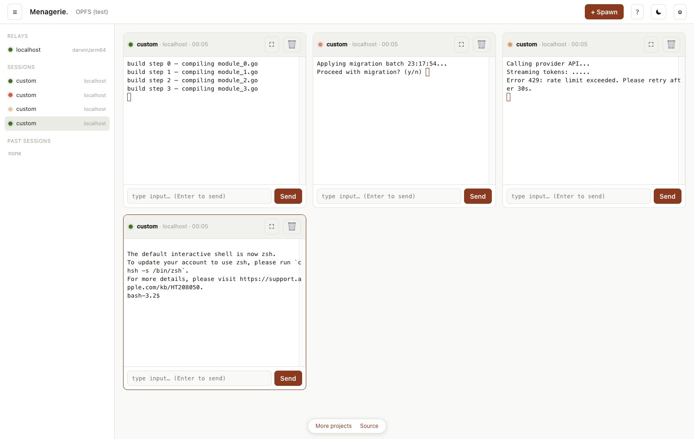

# Menagerie

**Run a whole fleet of coding agents — Claude Code, Codex, opencode, Aider, and friends — side by side in one browser tab.**



The page *is* the app. It streams each agent's terminal from small **relays** you run next to them. **No server we host, no account, no telemetry** — everything runs on your machines and nothing leaves them.

→ **Try it:** open **[menagerie.naklitechie.com](https://menagerie.naklitechie.com)**, then start a relay (below). It's also one static file — open `index.html` locally if you prefer.

## Get going in ~2 minutes

A relay is one small binary you run **once per machine** — not per agent. It launches and streams *every* agent on that box, so you start it once and leave it running.

**Install it** — Homebrew (macOS / Linux), no Go, no build step:

```sh
brew install naklitechie/tap/menagerie-relay
```

…or grab the prebuilt binary directly — `darwin-arm64` (Apple Silicon), `darwin-amd64` (Intel), `linux-amd64`, or `linux-arm64`:

```sh
curl -L -o menagerie-relay \
  https://github.com/NakliTechie/menagerie/releases/latest/download/menagerie-relay-darwin-arm64
chmod +x menagerie-relay
```

**Run it** — once per machine, then leave it running (drop the `./` if you installed via Homebrew):

```sh
./menagerie-relay serve    # first run sets up config + copies your token; leave it running
```

First run creates the config and **copies a registration token to your clipboard**. Open the app, paste it into the **localhost relay** card, and hit Connect — a guided checklist walks you the rest of the way. Full step-by-step with screenshots: **[the walkthrough](https://menagerie.naklitechie.com/docs/walkthrough/)**. Want the relay always-on (starts at login, restarts itself)? `./menagerie-relay service install`.

> **What Menagerie shows:** the relay runs the agents you launch from the app with **+ Spawn** — each in its own terminal it streams here. It doesn't watch other terminals you have open. (Want a terminal you started *yourself* to appear? Run it in tmux and set `adopt_foreign_tmux = true` — see [relay-setup](docs/relay-setup.md).)

> **Windows:** there's no native Windows build (the relay needs a Unix PTY) — run the **`linux-amd64`** binary inside **[WSL2](https://learn.microsoft.com/windows/wsl/install)**. The app reaches it over `localhost`, same as on Mac/Linux.
>
> **macOS Gatekeeper:** Homebrew **and** `curl` both run clean — only *browser* downloads get quarantined. If you grab it from the Releases page in a browser, clear the flag once: `xattr -dr com.apple.quarantine menagerie-relay`.
>
> **Prefer to build it?** `go install github.com/NakliTechie/menagerie/relay-go/cmd/menagerie-relay@latest`

## How it works

```
   Browser tab (one static HTML file)          ── you own the state:
   ─ grid of tiles · xterm.js per agent            relays + sessions +
   ─ light / dark · drag · fullscreen · replay     trajectories, saved to
        │         │          │                      a folder you pick (FSA)
        │ WSS     │ WSS      │ WSS
    ┌───▼──┐  ┌───▼──┐   ┌───▼──┐     each relay = one ~6 MB Go binary
    │relay │  │relay │   │relay │     that owns the PTYs and speaks one
    └──┬───┘  └──┬───┘   └──┬───┘     published WebSocket protocol
   claude-code  codex    opencode …
```

Anything the browser can do, an agent can do too — **the protocol *is* the SDK** ([`protocol/protocol.md`](protocol/protocol.md)). A relay handles many agents at once; run more relays only for more *machines*.

## What makes it different

- **Zero-server, vendor-neutral** — no daemon we host, agents listed alphabetically, nothing bundled or promoted.
- **You own the data** — sessions and full terminal trajectories live in your folder; replay any past run with a scrubber.
- **Built for many at once** — live status per tile (running · needs-input · rate-limited · idle), a chime when an agent needs you, drag to reorder, fullscreen any tile.
- **Survives refreshes** — relays keep running; reload the page and your live tiles re-attach.

## Repo layout

```
index.html     the whole browser app (no build step)
relay-go/      the reference relay — one Go binary (init · serve · token)
protocol/      the WebSocket protocol — the durable artifact (protocol.md + types.ts)
docs/          walkthrough · quickstart · relay-setup · writing-a-shim · security-model
```

## More

[`VISION.md`](VISION.md) · [`SPEC.md`](SPEC.md) · [`HANDOFF-v1.0.md`](HANDOFF-v1.0.md) · [`DEFERRED.md`](DEFERRED.md) — vision, locked decisions, full build spec, and what's deferred to v1.1+.

## License

[AGPL-3.0](LICENSE).
